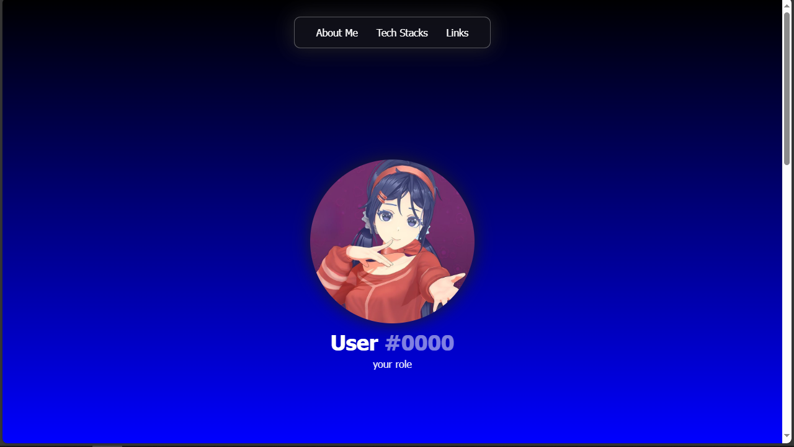

# 📝 4nderflow Portfolio Template:

 I made a template for those who are interested to get the same portfolio as mine.

# Template Preview

# How to get started?
To get started <a href="template-by-ander.html" download>click this link</a> to download the template file, and once you downloaded it, you can change anything you want.

# Note:
You don't need to download the style file in the stylesheets folder, all styles are in the template.

<b>👍 ENJOY IT</b>

